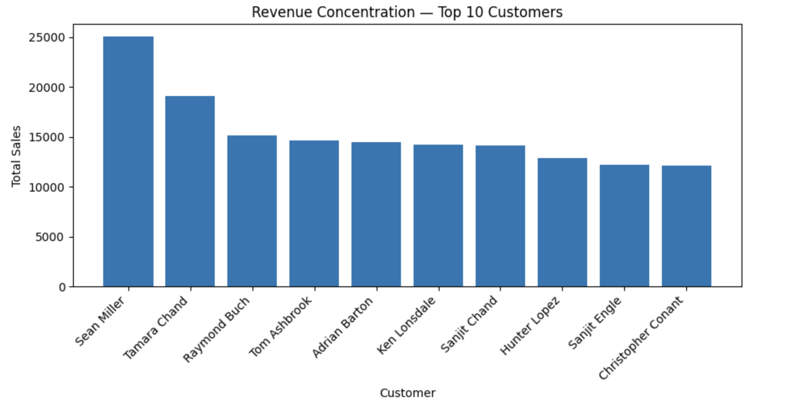
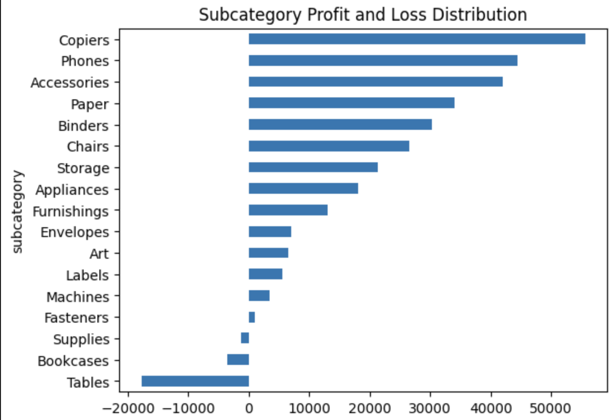
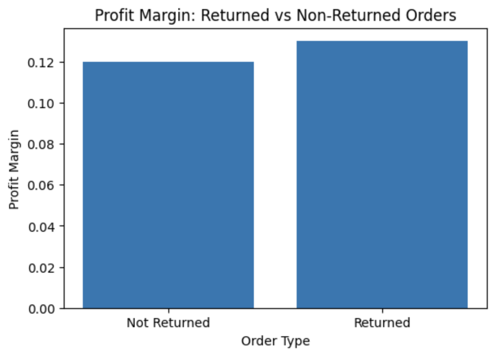
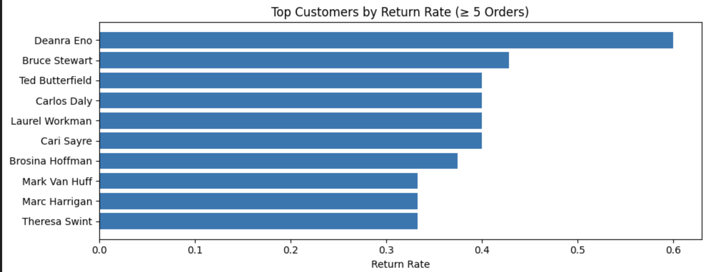
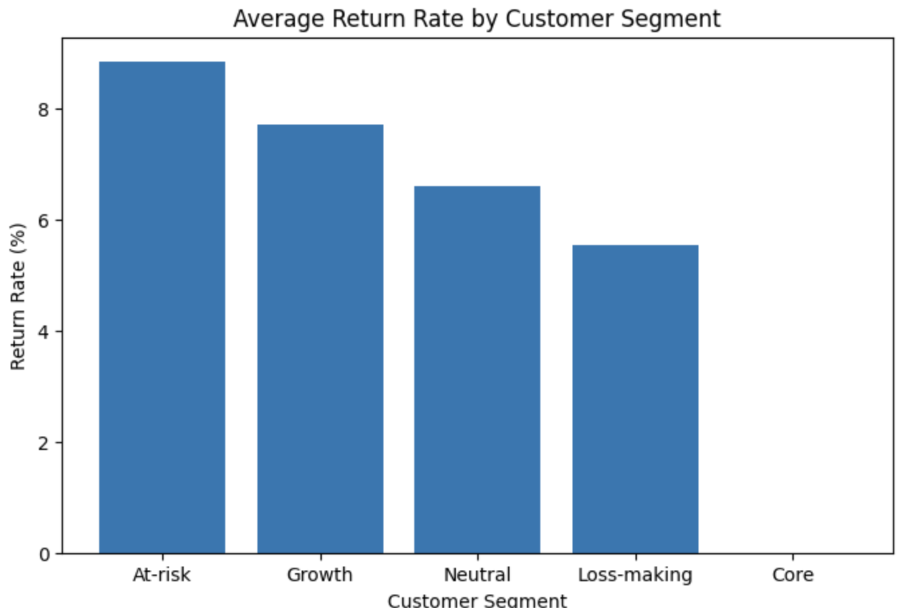

# Customer Risk & Revenue Intelligence  
### Credit-Inspired Customer Profitability & Risk Segmentation (SQL + Python)

This project applies portfolio-risk thinking from banking to customer-level revenue concentration and return-driven margin erosion.

Instead of simply identifying top customers, this analysis answers:

- Where is revenue concentration risk?
- Which customers are structurally eroding profitability?
- Is margin pressure driven by pricing or return behavior?
- What intervention framework should management implement?

The output is a decision-ready customer risk governance model.

---

## Business Problem

In high-volume transactional businesses, profitability erosion often hides behind:
- Revenue concentration risk
- Return-heavy customer behavior
- Structurally low-margin segments
- Uncontrolled discounting

Traditional reporting shows totals.  
This project builds a risk-layered framework to identify intervention targets.

---

## Dataset Overview

Superstore transactional dataset:

- `orders` — Line-item sales (sales, profit, subcategory, segment, region)
- `returns` — Order-level return flags
- `managers` — Region mapping

Data modeled at:
Line Item → Order → Customer → Segment → Region

---

## Tools & Techniques

- **SQL (SQLite)** — CTEs, window functions, revenue concentration analysis
- **Python (pandas, numpy)** — Aggregation, risk segmentation logic
- **Matplotlib** — Visual diagnostics
- Percentile-based thresholds (not arbitrary cutoffs)
- Structured customer segmentation logic

---

# Key Analytical Insights

---

## 1️⃣ Revenue Concentration Risk

Top customers drive disproportionate revenue exposure.

Implication:
Revenue dependency risk exists — concentration monitoring required.

---

## 2️⃣ Subcategory Profit & Loss Distribution

Certain product lines structurally erode profitability.

Key Observation:
- Tables category shows heavy structural losses.
- Copiers & Phones drive outsized profitability.

Implication:
Product-level pricing governance required.

---

## 3️⃣ Returns vs Non-Returns Margin Impact

Return-heavy behavior impacts structural margins.

Insight:
Returned orders exhibit margin instability — profitability protection requires return governance, not just repricing.

---

## 4️⃣ Return Rate Risk Customers (≥ 5 Orders)

High-frequency return customers represent margin erosion clusters.

These accounts require targeted intervention.

---

## 5️⃣ Segment-Level Return Behavior

Return behavior varies significantly by customer segment.

At-Risk and Growth segments show elevated return rates relative to Core accounts.

---

# Customer Risk Segmentation Framework

Customers classified into:

- **Core** — High margin, low return behavior
- **Growth** — Revenue expanding but margin volatile
- **Neutral** — Stable, moderate risk
- **At-Risk** — Elevated return frequency
- **Loss-Making** — Negative profitability despite revenue

This segmentation enables structured intervention.

---

# Priority Fix Targets (Intervention Table)

| Customer | Segment | Risk Driver | Suggested Action |
|-----------|----------|------------|------------------|
| High revenue + high returns | Consumer | Returns | Restrict return eligibility |
| Persistent loss customers | Corporate | Margin erosion | Renegotiate terms / exit |
| Thin margin + return stress | Corporate | Returns | Pre-approval return control |

80% of identified intervention targets are return-driven rather than pricing-driven.

**Strategic Conclusion:**
Return-policy governance will deliver faster margin stabilization than blanket repricing.

---

# Business Policy Framework

| Customer Type | Action Strategy |
|---------------|----------------|
| Core | Retain & incentivize |
| Growth (volatile margin) | Reprice / monitor |
| High-return behavior | Tighten return policy |
| Loss-making | Exit or restructure |

This converts analysis into executive decision logic.

---

# Files in Repository

- `P1_customer_risk_revenue_intelligence.ipynb`
- `P1_customer_risk_revenue_intelligence.html`
- `superstore_core_analysis.sql`
- `superstore.db`

---

# Executive Summary

This project demonstrates how credit-style portfolio analytics can be applied to customer revenue governance.

It bridges domain expertise in risk management with structured data analytics.

Focus:
Revenue Concentration → Return Behavior → Margin Stability → Policy Action
