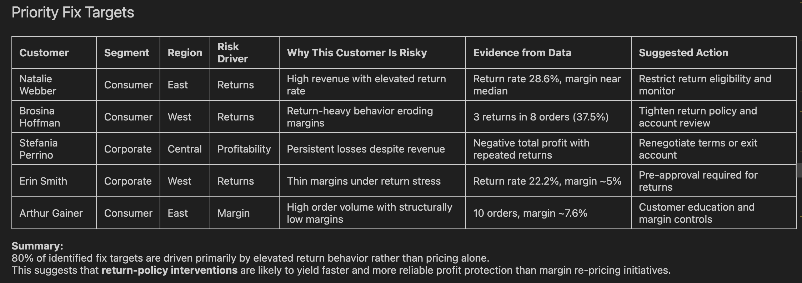

# Customer Risk & Revenue Intelligence
### Credit-Inspired Customer Profitability & Risk Segmentation (SQL + Python)

This project applies portfolio-risk thinking from banking to customer-level revenue
concentration and return-driven margin erosion.

Instead of simply identifying top customers, this analysis answers:

- Where is revenue concentration risk?
- Which customers are structurally eroding profitability?
- Is margin pressure driven by pricing or return behavior?
- What intervention framework should management implement?

The output is a decision-ready customer risk governance model.

---

## Dataset

**Source:** Superstore transactional dataset (SQLite)
- `orders` — Line-item sales (sales, profit, subcategory, segment, region)
- `returns` — Order-level return flags
- `managers` — Region mapping

Data modelled at: Line Item → Order → Customer → Segment → Region

> Note: Originally built in Google Colab. To run locally, replace the `drive.mount()`
> cell with your local file path. Superstore dataset available via Tableau Public or Kaggle.

---

## Tools & Techniques

- **SQL (SQLite)** — CTEs, window functions, revenue concentration analysis
- **Python (pandas, numpy)** — Aggregation, risk segmentation logic
- **Matplotlib** — Visual diagnostics
- Percentile-based thresholds (not arbitrary cutoffs)
- Structured customer segmentation logic

---

## Key Analytical Insights

---

### 1️⃣ Revenue Concentration Risk

Top customers drive disproportionate revenue exposure.

Top 20 customers contribute ~11.5% of total sales.
Revenue dependency risk exists — concentration monitoring required.

---

### 2️⃣ Subcategory Profit & Loss Distribution

Certain product lines structurally erode profitability regardless of revenue contribution.

- Tables: single largest loss driver (~₹17,000+ in losses)
- Copiers & Phones: drive outsized profitability
- Loss is subcategory-structural, not customer-driven

Product-level pricing governance required before customer-level intervention.

---

### 3️⃣ Return Rate Risk Customers (≥ 5 Orders)

High-frequency return customers represent concentrated margin erosion clusters.

Top return-rate customers exceed 40–60% return frequency.
These accounts require targeted intervention — not broad policy changes.

---

### 4️⃣ Segment-Level Return Behaviour

Return behaviour varies significantly by customer segment.

At-Risk and Growth segments show elevated return rates relative to Core accounts.
Core segment shows near-zero return rate — the benchmark for healthy account behaviour.

---

### 5️⃣ Returned vs Non-Returned Order Margins

Aggregate margin difference between returned and non-returned orders is small.
This confirms that margin risk from returns is **not visible in aggregate** —
it is concentrated in specific high-return customers identified above.
Targeting those accounts will recover more margin than blanket repricing.

---

## Customer Risk Segmentation Framework

Customers classified into five tiers using percentile-based thresholds:

| Segment | Profile |
|---|---|
| Core | High margin, low return rate — retain and protect |
| Growth | Revenue expanding but margin volatile — monitor closely |
| Neutral | Stable, moderate risk — standard treatment |
| At-Risk | Elevated return frequency — tighten return policy |
| Loss-Making | Negative profitability despite revenue — renegotiate or exit |

---

## Priority Fix Targets

80% of identified intervention targets are return-driven rather than pricing-driven.

**Strategic conclusion:** Return-policy governance will deliver faster margin
stabilisation than blanket repricing initiatives.

---

## Business Policy Framework

| Customer Type | Action Strategy |
|---|---|
| Core | Retain & incentivise |
| Growth (volatile margin) | Reprice / monitor |
| High-return behaviour | Tighten return eligibility |
| Loss-making | Exit or restructure terms |

---

## Files in This Folder

- `P1_customer_risk_revenue_intelligence.ipynb`
- `P1_customer_risk_revenue_intelligence.html`
- `superstore_core_analysis.sql`
- `superstore.db`

---

## Executive Summary

This project demonstrates how credit-style portfolio analytics can be applied to
customer revenue governance. It bridges domain expertise in risk management with
structured data analytics.

Focus: Revenue Concentration → Return Behaviour → Margin Stability → Policy Action
