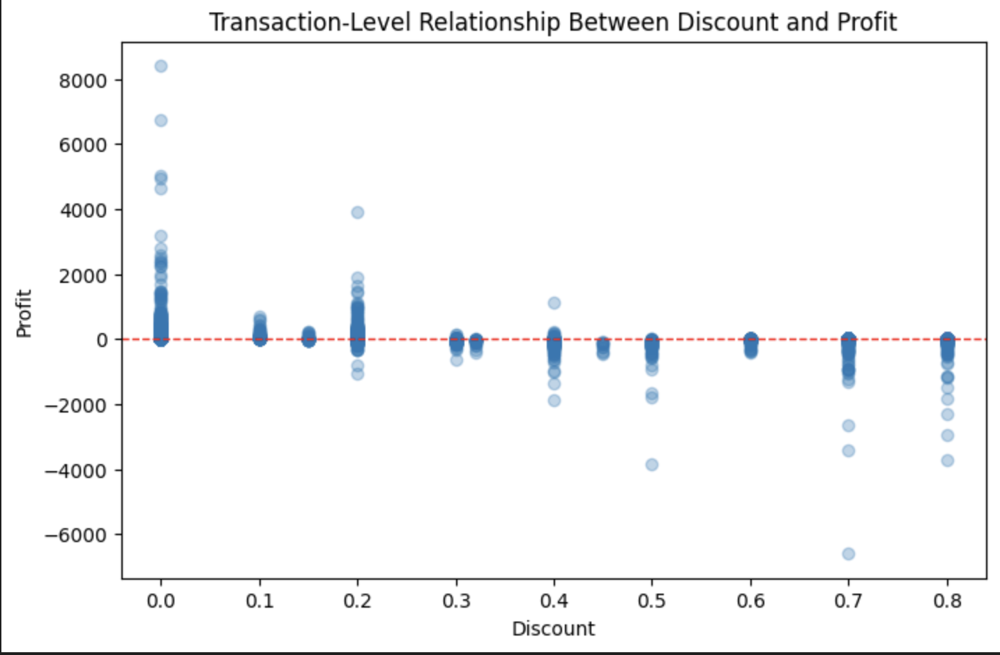
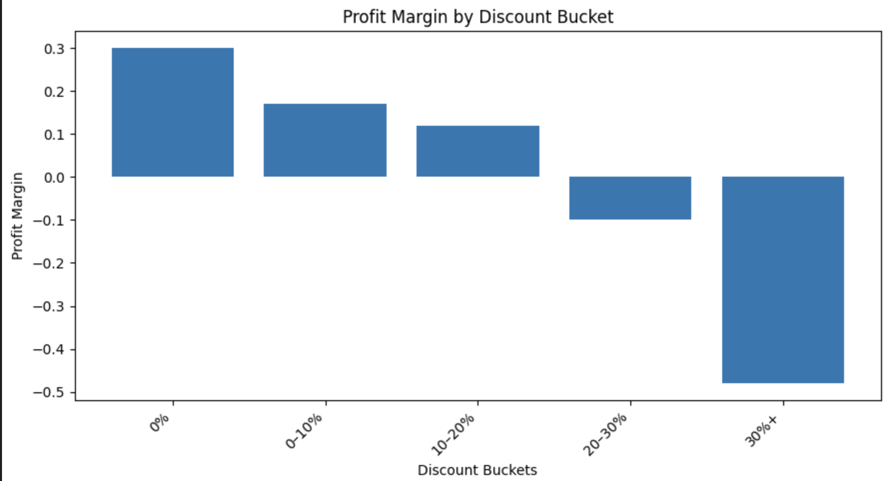
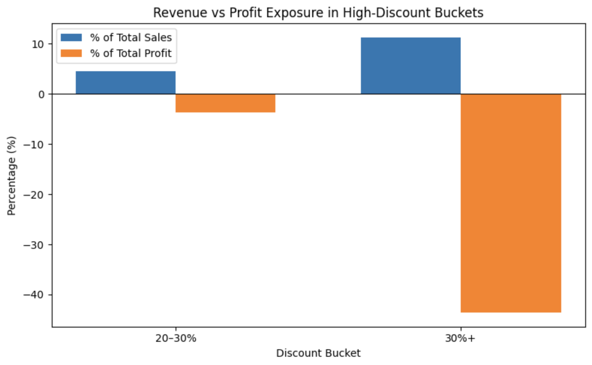
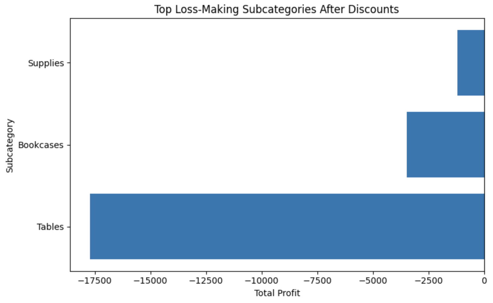
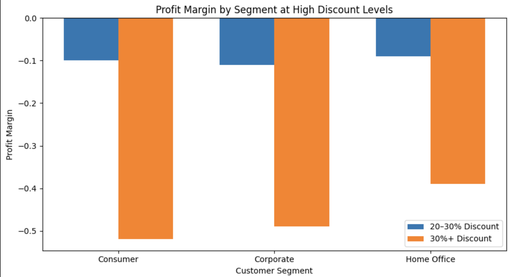
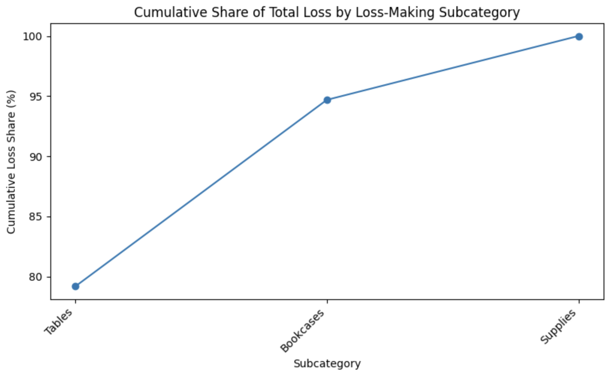

# Pricing, Discount & Profit Leakage Intelligence  
### Structural Margin Erosion Analysis (Python)

This project analyzes transaction-level discounting behavior to identify structural profit leakage, value-destructive pricing patterns, and concentration of margin erosion across segments and subcategories.

Instead of asking “What are our discounts?”, this analysis asks:

- At what discount threshold does margin collapse?
- How much total profit is destroyed by high-discount deals?
- Is leakage systemic or concentrated?
- Which pricing controls would recover margin fastest?

The output is a discount governance framework.

---

## Business Problem

Discounting is often used as a revenue growth lever.

However:
- Excessive discounting can structurally destroy margin.
- A small number of bad deals can drive disproportionate losses.
- Not all discounting is equal — some levels are economically viable, others are value-destructive.

This project isolates where discounting shifts from strategic lever to profit leakage engine.

---

## Dataset Overview

Superstore transactional dataset:

- `orders` — line-item sales, profit, discount, segment, subcategory

Modeled at transaction-level to isolate pricing effects.

---

## Tools & Techniques

- Python (pandas, numpy)
- Discount bucketization:
  - 0%
  - 0–10%
  - 10–20%
  - 20–30%
  - 30%+
- Margin analysis by discount bucket
- Revenue vs profit exposure comparison
- Pareto-style loss concentration analysis

---

# Key Analytical Insights

---

## 1️⃣ Transaction-Level Discount vs Profit

Observation:
Profit dispersion collapses sharply beyond 20% discount.
High-discount transactions cluster in negative territory.

---

## 2️⃣ Profit Margin by Discount Bucket

Critical Finding:

- 0% discount → ~30% margin
- 0–10% → healthy margin
- 10–20% → still viable
- 20–30% → negative margin
- 30%+ → structurally destructive

Discounts above **20%** consistently destroy value.

---

## 3️⃣ Revenue vs Profit Exposure in High-Discount Buckets

Key Insight:

High-discount buckets represent a meaningful share of revenue  
but destroy a disproportionate share of total profit.

This is concentrated leakage.

---

## 4️⃣ Top Loss-Making Subcategories

Tables, Bookcases, and Supplies drive majority of structural losses.

---

## 5️⃣ Segment-Level Impact at High Discounts

All segments show negative margin at >30% discount.

Loss severity highest in Consumer and Corporate segments.

---

## 6️⃣ Loss Concentration (Pareto Analysis)

Nearly 80% of total losses are concentrated in a small subset of subcategories.

Profit leakage is not systemic — it is highly concentrated.

---

# Structural Conclusion

Discounting above 20% is not a growth lever.

It is a margin destruction mechanism.

Profit erosion is concentrated in:
- Specific subcategories
- Specific high-discount buckets
- A small number of structurally weak pricing patterns

---

# Pricing Governance Framework

| Discount Level | Policy Recommendation |
|----------------|----------------------|
| 0–10% | Fully allowed |
| 10–20% | Controlled approval |
| 20–30% | Exception-based approval only |
| 30%+ | Prohibited unless strategic clearance |

Subcategory-level pricing review required for:
- Tables
- Bookcases
- Supplies

---

# Business Impact Logic

Instead of blanket price increases, implement:

- Discount caps at 20%
- Deal-level approval workflows
- Subcategory repricing for structural loss drivers
- Segment-specific pricing rules

This approach protects margin without sacrificing controlled growth.

---

# Files in Repository

- `P2_pricing_discount_profit_leakage.ipynb`
- `P2_pricing_discount_profit_leakage.html`

---

# Executive Summary

This project demonstrates how pricing analytics can move from descriptive reporting to enforceable pricing control design.

It applies structured financial logic to discount governance, isolating the precise point where revenue growth turns into profit leakage.
