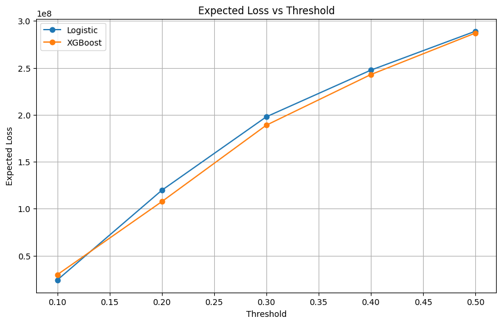
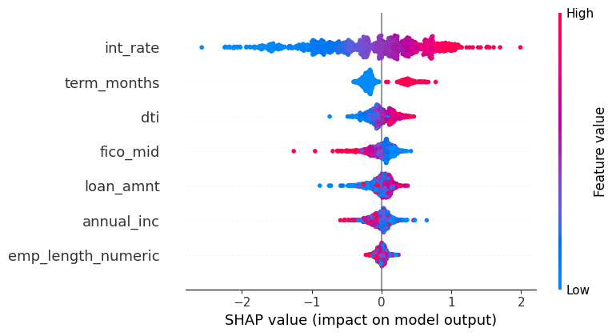

# Loan Portfolio Risk & Recovery Intelligence
### From Default Metrics to Credit Policy Decisions (Python + Power BI)

This project analyses a 500K+ loan consumer portfolio to identify structural 
risk multipliers, economic loss concentration, pricing inflection failure, 
predictive default modelling, and explicit credit policy interventions.

It is a **end-to-end credit risk framework** designed to answer:

> If this were a live ₹500–1000 Cr lending book, what credit rule would 
> I change tomorrow — and which borrowers should never have been approved?

---

## Dataset

**Source:** Lending Club Accepted Loans (2007–2018)  
**Size:** 500,000 records  
**Available at:** [Kaggle — Lending Club Loan Data](https://www.kaggle.com/datasets/wordsforthewise/lending-club)

> Note: Originally built in Google Colab. To run locally, replace the 
> `drive.mount()` cell with your local file path to the dataset CSV.

---

## Tools Used

- Python (pandas, numpy, matplotlib, seaborn, scikit-learn, XGBoost, SHAP)
- Segmentation & binning logic
- Loss decomposition & Pareto concentration analysis
- Predictive modelling — Logistic Regression + XGBoost
- Power BI (executive dashboard layer)

---

## Executive Dashboard (Power BI)

### Portfolio Overview

**Key metrics:** 500K loans · 15.8% default rate · $455.6M total net loss · 
7.9% avg recovery rate

---

### Risk Segmentation Deep Dive

**High-risk cluster:** 38.1% default rate · only 0.72% of portfolio  
**Medium-risk (2 of 3 triggers):** 29.1% default rate · 8.07% of portfolio

High intensity risk exists but is not scaled — opportunity to tighten 
underwriting before it grows.

---

## Analytical Evidence (Python)

---

### 1️⃣ Tenor as Structural Risk Amplifier

60-month loans default at **21.6%** vs **13.0%** for 36-month loans.

Average loss per default: **~$9,300 for 60-month** vs **~$5,000 for 36-month**.

60-month tenor amplifies both default frequency AND loss severity.
This is a structural underwriting risk, not a pricing question.

---

### 2️⃣ Interest Rate Inflection: Where Pricing Fails

- Net loss rate stays negative (profitable) up to the 14–16% bucket
- Crosses zero between **16–18%**
- Turns clearly positive at **18%+**

Beyond 16–18%, higher interest charged does not compensate for rising 
default losses. This is adverse selection — borrowers accepting high-rate 
loans are disproportionately those who cannot repay.

---

### 3️⃣ Credit Grade Mispricing

Interest rate increases linearly from Grade A to G.
Default rate accelerates — rising faster than pricing from Grade D onwards.

The gap between the two lines at Grades E–G is where the portfolio loses 
money. Pricing follows a linear rule; risk follows an exponential one.

---

### 4️⃣ Loss Concentration (Pareto Analysis)

Top 20% of loss-making loans drive **~48% of total economic loss**.

Loss is partially concentrated — enabling surgical intervention rather 
than broad credit tightening.

---

## Section 5 — Predictive Credit Scoring Model

### Objective

Historical analysis identifies where losses occurred.
Predictive modelling answers: **which new applicants are likely to default?**

Two models were built using only underwriting-time variables — 
deliberately excluding post-outcome data to prevent leakage.

**Features used:** loan amount · term · interest rate · annual income · 
DTI · FICO score · employment length

---

### Model Performance

| Metric | Logistic Regression | XGBoost |
|---|---|---|
| AUC | 0.727 | 0.727 |
| Gini | 0.454 | 0.454 |
| KS Statistic | — | 0.335 |

Both models achieved similar performance on this feature set, indicating 
the underlying relationships are largely linear with core underwriting 
variables. This is expected — production models with full bureau data 
typically achieve AUC of 0.80–0.85 and KS of 0.45–0.60.

**Key insight:** At a standard 0.5 threshold both models show low recall 
for defaults. Threshold tuning is essential for credit decisioning.

---

### Threshold Strategy & Expected Loss

| Threshold | Model | Acceptance Rate | Bad Rate | Expected Loss |
|---|---|---|---|---|
| 0.1 | XGBoost | 27.9% | 6.5% | $29.7M |
| 0.2 | XGBoost | 59.9% | 10.9% | $97.2M |
| 0.3 | XGBoost | 79.4% | 14.2% | $168M |
| 0.5 | XGBoost | 96.1% | 18.8% | $269M |

**Key insight:** Decision policy (threshold selection) has greater impact 
on portfolio outcomes than incremental model accuracy improvements. 
A threshold of 0.2 balances risk control with business growth.

---

### Model Explainability (SHAP)

SHAP values confirm the model learned the same relationships a credit 
officer would apply:

- **loan_percent_income** — strongest default driver, consistent with 
  DTI analysis above
- **int_rate** — high rates increase default probability, aligns with 
  16–18% inflection finding
- **fico_mid** — higher credit scores reduce default probability

The model is not a black box — it reflects underwriting logic that can 
be explained to regulators and credit committees.

---

## Structural Risk Drivers

| Risk Driver | Finding |
|---|---|
| Loan tenor | 60-month: 21.6% default rate, ~$9,300 avg loss per default |
| Interest rate | Net loss turns positive beyond 16–18% |
| Credit grade | Grades E–G structurally mispriced relative to actual loss |
| DTI | 30–40% bucket peaks at 22.5% default rate |
| Loan purpose | Debt consolidation & small business drive highest absolute losses |

---

## Credit Policy Playbook

| Category | Policy Action | Rationale |
|---|---|---|
| STOP | 60-month loans, DTI > 30%, Grade D+ | Higher default frequency AND severity |
| STOP | New originations priced above 18% | Net loss turns positive beyond this point |
| START | Pricing floors by grade and term (C–E) | Lower grades need stronger loss coverage |
| START | DTI caps for 60-month loan approvals | Tenor amplifies concentration risk |
| CONTINUE | Grade A–B, 36-month loans | Stable core, lower loss intensity |

---

## Strategic Conclusion

This portfolio does not suffer from random defaults.

It suffers from tenor leverage risk, pricing inflection failure, and 
concentrated loss drivers in specific borrower segments.

Risk is partially concentrated — enabling **surgical tightening, 
not broad credit contraction.**

The predictive model confirms these findings — SHAP values align with 
the structural risk drivers identified through portfolio analysis, 
validating both the analytical and modelling approach.

---

## Files in This Folder

- `P3_loan_portfolio_risk_recovery_intelligence.ipynb`
- `P3_loan_portfolio_risk_recovery_intelligence.html`
