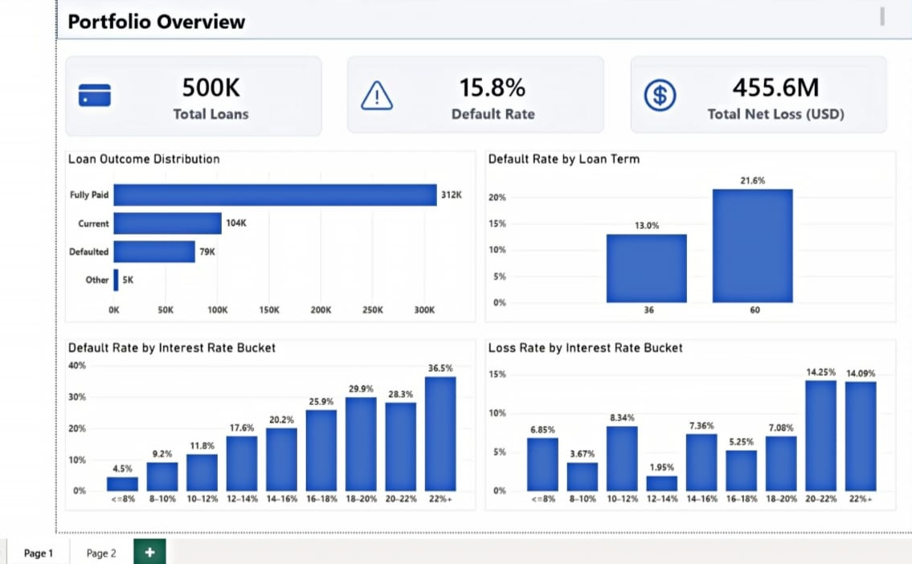
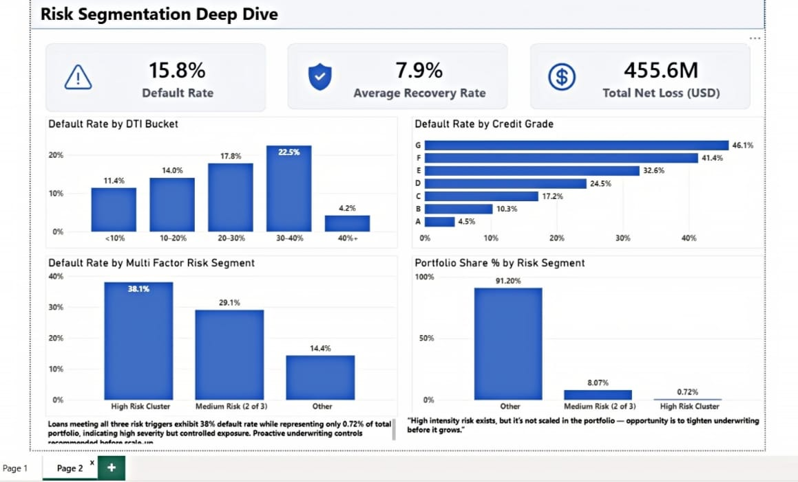
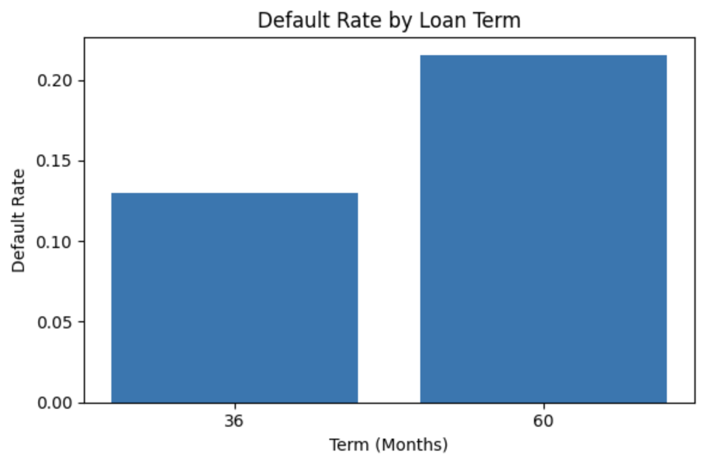
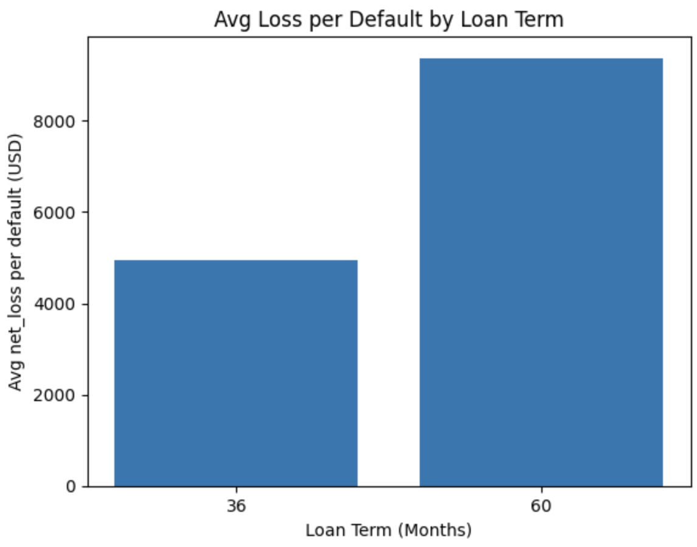
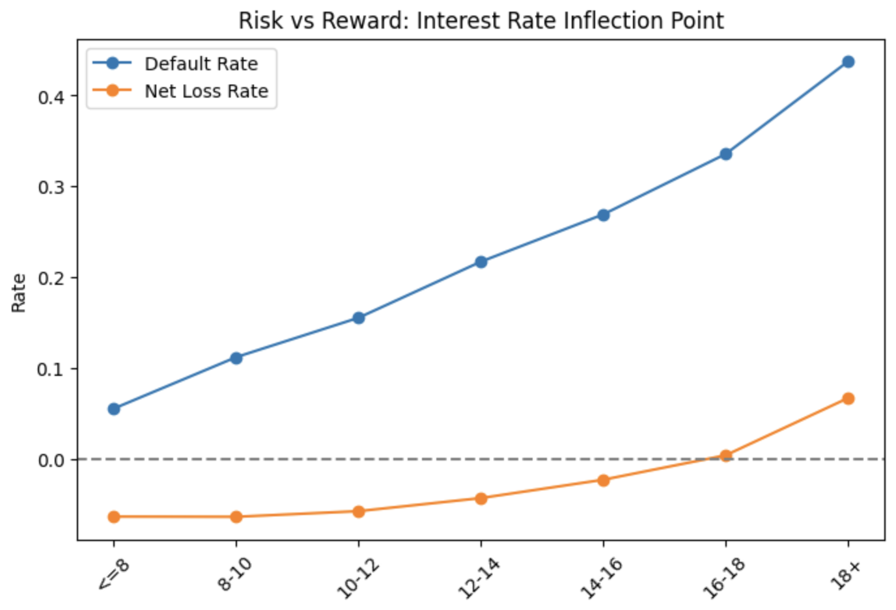
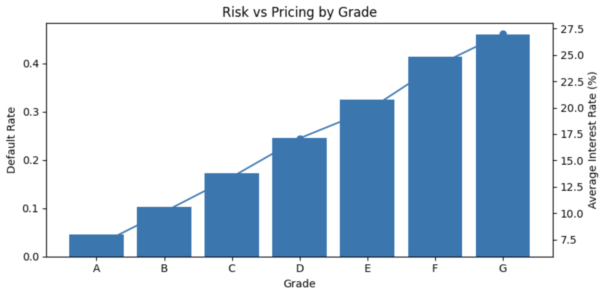
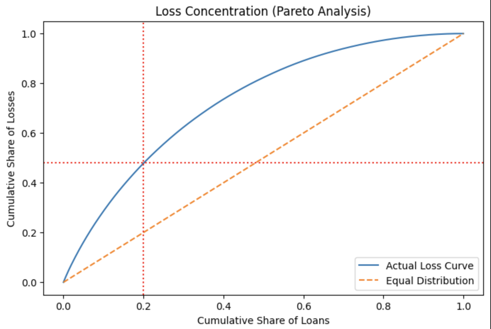

# Loan Portfolio Risk & Recovery Intelligence  
### From Default Metrics to Credit Policy Decisions (Python + Power BI)

This project analyzes a 600K+ loan consumer portfolio to uncover:

- Structural risk multipliers  
- Economic loss concentration  
- Pricing inflection failure  
- Explicit credit policy interventions  

This is not a machine learning project.

It is a **portfolio decision intelligence framework** designed to answer:

> If this were a ₹500–₹1000 Cr portfolio, what credit rule would I change tomorrow?

---

# Executive Dashboard (Power BI View)

## Portfolio Overview

Key Metrics:
- ~500K loans
- 15.8% default rate
- $455.6M total net loss
- 7.9% average recovery rate

---

## Risk Segmentation Deep Dive

Highlights:
- High-risk cluster default rate: 38%
- Medium-risk (2 triggers): 29%
- High-risk cluster represents only 0.7% of portfolio → high severity but limited scale
- 60-month loans show materially higher default rates

This indicates structural leverage risk rather than random portfolio noise.

---

# Analytical Evidence (Python Deep Dive)

---

## 1️⃣ Default & Loss Severity by Loan Term

### Default Rate by Term

60-month loans default materially more than 36-month loans.

---

### Average Loss per Default by Term

Loss severity is significantly higher for 60-month loans.

**Conclusion:**  
Tenor is a structural risk amplifier — not merely a pricing decision.

---

## 2️⃣ Pricing Inflection: Risk vs Reward

### Interest Rate Inflection Curve

Observation:
- Default rate rises steadily with interest rate
- Beyond ~16–18%, net loss turns positive
- Pricing no longer compensates for risk

This indicates adverse selection in high-rate buckets.

---

### Risk vs Pricing by Credit Grade

Lower grades (D–G):
- Exhibit sharply rising default rates
- Pricing increase is insufficient to offset loss escalation

Some grades are structurally mispriced.

---

## 3️⃣ Loss Concentration (Pareto Logic)

Top 20% of loss-driving loans contribute ~48% of total net loss.

Loss is partially concentrated — allowing targeted intervention rather than blanket tightening.

---

# Structural Risk Drivers Identified

- 60-month tenor amplifies both frequency and severity of loss
- Pricing beyond ~16–18% fails economically
- Grades D–G generate disproportionate loss contribution
- High DTI (>40%) loans exhibit tail-risk behavior
- Debt consolidation & credit card purposes drive high absolute losses

---

# Credit Policy Playbook

| Category | Policy Action | Rationale |
|----------|--------------|-----------|
| STOP / Restrict | 60-month loans in high DTI / weak affordability bands | 60M loans show higher default & higher loss severity |
| STOP / Restrict | Pricing beyond 16–18% without strong recovery economics | Loss flips positive in high-rate buckets |
| START | Pricing floors by grade & term (C–E focus) | Lower grades require stronger loss coverage |
| START | Tenor-based underwriting caps (DTI tightening for 60M) | Tenor amplifies concentration risk |
| CONTINUE | Grade A–B, especially 36M loans | Stable core, lower loss intensity |

---

# Strategic Conclusion

This portfolio does not suffer from random defaults.

It suffers from:

- Tenor leverage risk  
- Pricing inflection failure  
- Concentrated loss drivers in specific borrower segments  

Risk is partially concentrated.

This enables surgical tightening — not broad credit contraction.

---

# Tools Used

- Python (pandas, numpy)
- Segmentation & binning logic
- Loss decomposition
- Pareto concentration analysis
- Power BI (Executive dashboard layer)

No machine learning was used intentionally.

Focus: Decision intelligence, not prediction accuracy.

---

# Intended Audience

- Credit Risk Leaders
- Portfolio Strategy Teams
- FinTech / NBFC Risk Units
- Senior Analytics Roles

---

# Core Question Answered

If this were a live lending book:

What should be tightened, repriced, scaled, or stopped tomorrow?
